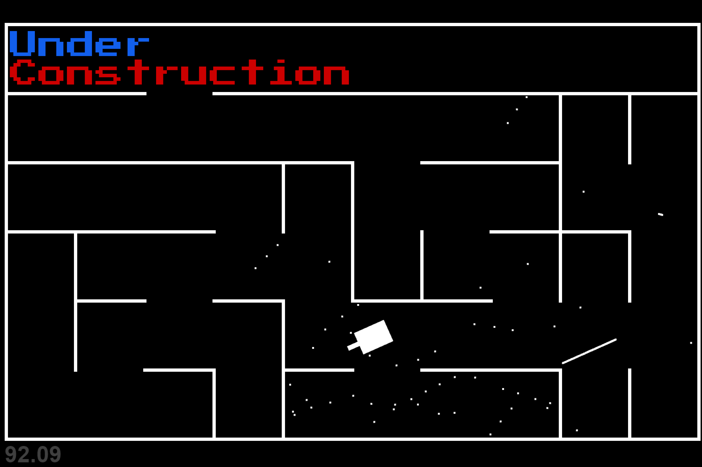

# Python-Tank-Game
Just practicing my proficiency in Python by recreating a game called Tank Trouble. Features a maze level generator and a quadtree for smart collision detection. Right now the player does not scale with the level and does not collide. Idk when I might continue this project but it is still interesting as it is.

This game requires pyglet, numpy, and pyqtree to run

